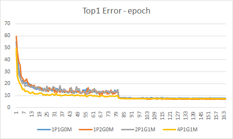
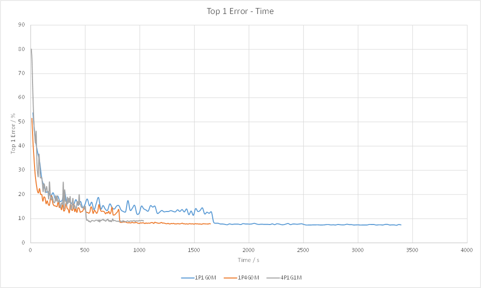
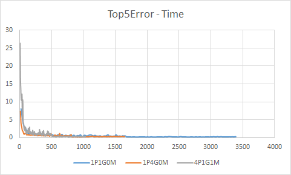
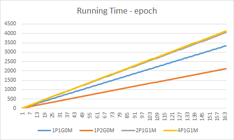

#Multiverso Torch Binding Benchmark

## Task Description

Perform CIFAR-10 classification with torch resnet implementation.

## Codebase

[Microsoft/fb.resnet.torch multiverso branch](https://github.com/Microsoft/fb.resnet.torch/tree/multiverso)

## Hardware

- **Hosts** : 1
- **GPU** : GeForce GTX TITAN X * 4
- **CPU** : ntel(R) Core(TM) i7-5960X CPU @ 3.00GHz  * 16
- **Memory** : 128GB

## Common settings

- batchSize 128
- depth 32
- nEpochs 164

## Clarification for multiverso settings

- Epoch means epoch for each worker with multiverso.
- Learning rate is divided by the number of workers.
- We choose master strategy to warm up the initial model.
- Workers sync after each batch and has a barrier after each epoch.

## Results

| Code Name | #Process | #GPU | With multiverso | Best Model            |
| :-------: | :------: | :--: | :-------------: | --------------------- |
| 1P1G0M    | 1        | 1    | 0               | top1:7.634 top5:0.218 |
| 1P2G0M    | 1        | 2    | 0               | top1:6.883 top5:0.316 |
| 2P1G1M    | 2        | 1    | 1               | top1:7.397 top5:0.336 |
| 4P1G1M    | 4        | 1    | 1               | top1:7.259 top5:0.287 |

