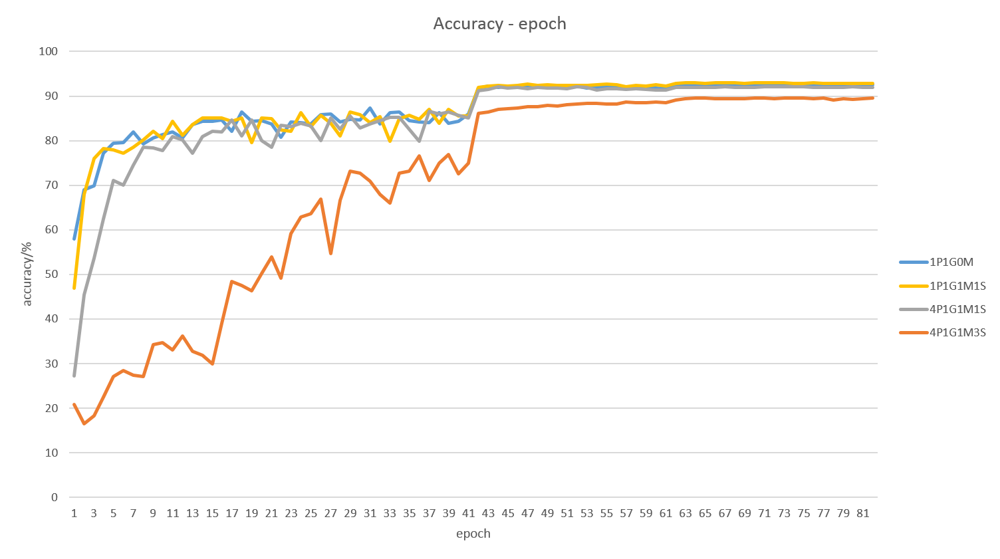
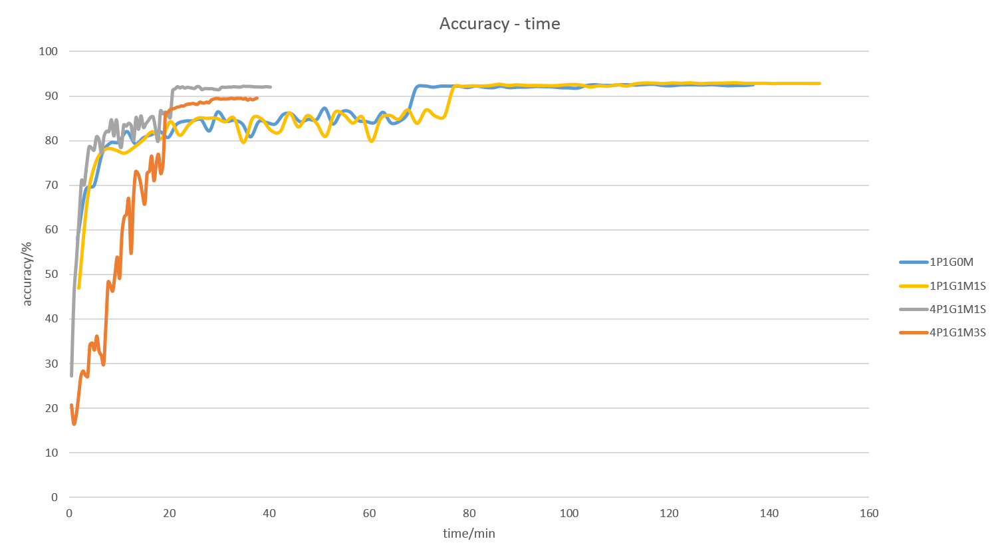
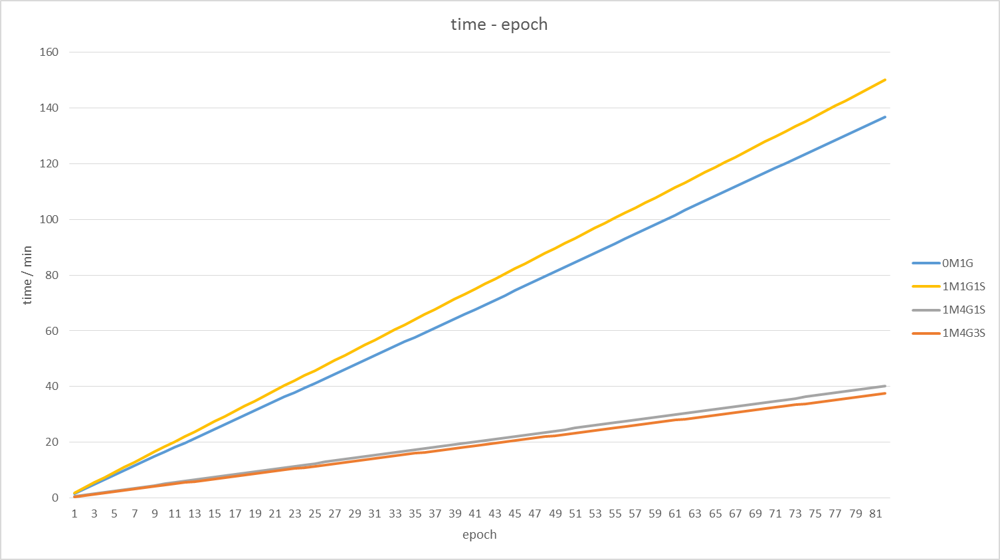

# Requirements

## On linux
I presume you followed the [README](../../README.md) and have build multiverso successfully.

## On windows
I presume you have MSBuild.exe installed and your system can find it in the $PATH．　Then you should run [build_dll.bat](../../src/build_dll.bat)　to build the .dll file.


# Run tests
```
nosetests
```


# Run logistic regression example with multi-process
```
mpirun -np 4 python ./examples/theano/logistic_regression.py
```


# How to write python code with multiverso
You can start with the [test example](./multiverso/test.py) to learn the basic use of multiverso apis.

Then you test and run the [examples](./examples/).  The original code links are written at the beginning of them. You can compare the multiverso version with the original ones to find the differences.
The places need to be modified to use multiverso are all inserted comments like `# MULTIVERSO: XXX`


# How to use multiverso in theano
First, make sure you have understood `mv.init()`, `mv.shutdown()` and `mv.barrier()` mentioned in last section.  You should add the same functions in your theano python script.

In theano, parameters usually stored in sharedVariables.

For example, you may find code like this in a theano script
```
self.W = theano.shared(
    value=numpy.zeros(
        (n_in, n_out),
        dtype=theano.config.floatX
    ),
    name='W',
    borrow=True
)
```

If you want to use multiverso, you can modify them like this.
```
from multiverso.theano_ext import sharedvar
W = sharedvar.mv_shared(
    value=numpy.zeros(
        (n_in, n_out),
        dtype=theano.config.floatX
    ),
    name='W',
    borrow=True
)

# build the model

# train the modle

# When you are ready to add the delta of the variable to parameter server and sync the latest value, you can run this function
W.mv_sync()


# If you want to sync all variables created by `sharedvar.mv_shared`, you can use this function
sharedvar.sync_all_mv_shared_vars()
```

If your program will run in multi-process and you want to initialize your parameters, you should initialize your shared variables with the value you want only in one process and initialize them with zero in other processes.


If you don't use shared variables to store and update the parameters, you can still use the `add` and `get` functions to sync parameters


# How to use multiverso in lasagne
First, make sure you have understood the last section.

Lasagne provides many functions to help you build models more easily. Multiverso python binding provides a convenient manager to make managing and synchronizing the variables more easily.

You can use code like this to manage your parameters
```
from multiverso.theano_ext.lasagne_ext import param_manager

network = build_model()  # build_model is a function you implement to build model

# When is_master_worker is true, the process will initialize the parameters.
# Make sure only one process will initialize the parameters. So is_master_worker
# is true only in one process.
mvnpm = param_manager.MVNetParamManager(network, is_master_worker)

# training the model

# When you are ready to add the delta of the variable in this model to the parameter server and get the latest value, you can run this function
mvnpm.update_all_param()
```

# How to use multi-GPU in theano with multiverso
Assuming you have multiple GPUs in your server and you have installed the (CUDA backend)[http://deeplearning.net/software/theano/tutorial/using_gpu.html#cuda].

First make sure you have read [this section](http://deeplearning.net/software/theano/install.html#using-the-gpu) and understand how to configure which GPU will be used.

With multiverso, your program will run in multiple processes. If you hope that different GPUs will be used in different processes, it is not so convenient to configure it as usual.

Here is a example to achieve that different GPUs will be used in different processes.
In this example, the i-th worker will use the i-th gpu. You can add code like this before `import theano`
```
import multiverso as mv
mv.init()
worker_id = mv.worker_id()
# NOTICE: To use multiple gpus, we must set the environment before import theano.
if "THEANO_FLAGS" not in os.environ:
    os.environ["THEANO_FLAGS"] = 'floatX=float32,device=gpu%d,lib.cnmem=1' % worker_id

# import theano after this
```

# Experiments

Here is the result of running [Deep_Residual_Learning_CIFAR-10](./examples/theano/lasagne/Deep_Residual_Learning_CIFAR-10.py)

## Hardware
|||
| -------- |:--------:|
|Hosts|1|
|GPU|GeForce GTX TITAN X * 4|
|CPU|Intel(R) Core(TM) i7-5960X CPU @ 3.00GHz  * 1|


## Theano settings
Here is the settings in my `~/.theanorc`
```
[global]
device = gpu
floatX = float32

[cuda]
root = /usr/local/cuda-7.5/

[lib]
cnmem = 1
```

## About the Model
|||
| :---- | -----: |
|Total epoch|82|
|Batch size|128|
|Depth|32|
|Learning rate change schedule|Initialized as 0.1, Changed to 0.01 from epoch 41, Changed to 0.001 from epoch 61|
|number of parameters in model|    464,154|


Clarification
- An epoch represents all the processes divides all the data equally and  go through them once together
- A barrier is used at the end of every epoch
- I didn't use warm start in  ASGD
- The time to load the data is not considered in the experiment.


# The results
I've run 4 experiments. The configuration and the result of each configuration are listed below.

|Short Name | With multiverso | number of Process | number of GPU | Sync every X minibatches |  Best model validation accuracy | Time per epoch / s |
| :---- | :-----: | :-----: | :-----: | :-----: | :-----: | :-----: |
| 0M-1G | 0 | 1 | 1 | --| 92.61 % | 100.02|
|1M-1G-1S | 1 | 1 | 1 | 1 | 92.61 % | 109.78|
|1M-4G-1S | 1 | 4 | 4 | 1 | 92.15 % | 29.38|
|1M-4G-3S | 1 | 4 | 4 | 3 | 89.61 % | 27.46|




